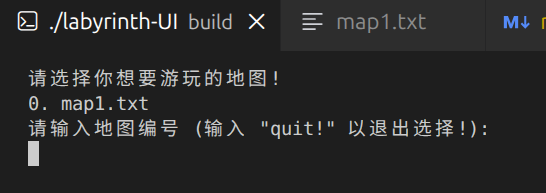
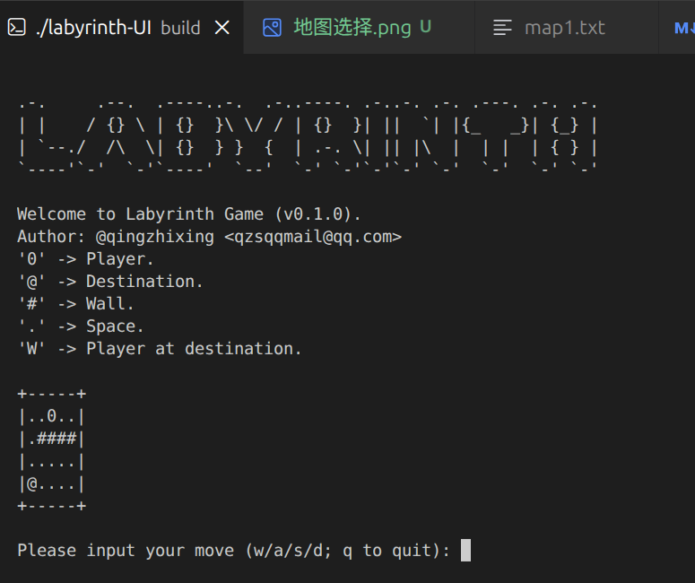

# 🌟 Labyrinth Game

本项目来自 jyy **操作系统原理 (2025 春季学期)** 的第一个Lab: [M1: 迷宫游戏 (labyrinth)](https://jyywiki.cn/OS/2025/labs/M1.md)

## 🤖 项目展示




## 🎄 项目结构

```text
.
├── common  # Core和UI 公共头文件
├── debug_utils # 调试工具
├── labyrinth.code-workspace # VSCode Workspace 配置文件
├── labyrinth-Core # Labyrinth Game 后端代码
├── labyrinth-UI # Labyrinth Game 前端代码
├── readme.md
├── run_tests.py # 测试脚本
├── static  # 静态资源, 比如说 readme.md需要的图片
├── testkit  # 测试代码库,来自jyy,我做了一些改动,支持更好的展示
└── xmake.lua  # xmake构建脚本
```

## 🔧 构建项目

使用 xmake 构建项目:

```bash
xmake
```

## 🔍 运行测试

```bash
./run_tests.py
./run_tests.py -v # 展示调试输出信息
```

## 🔄 运行项目

1. 先构建项目
2. 确保 `labyrinth-UI` 和 `labyrinth-Core` 在同一目录下
3. 在它们的目录下创建地图 `(*.txt)` 文件
4. 运行 `labyrinth-UI`

## 📃 地图格式

若干行，每行包含相同数量的字符，代表迷宫地图
字符含义：

- '#' ：墙壁
- '.'：空地
- '0'：玩家
- '@'：终点

> 1. 迷宫不超过 100 行、100 列
> 2. 迷宫中所有空地必须是连通的，即从任意一个空地可以到达任意其他空地 (玩家视为空地)
> 3. 若不存在玩家,则将玩家放置在第一个空地（从上到下，从左到右查找第一个空地）
